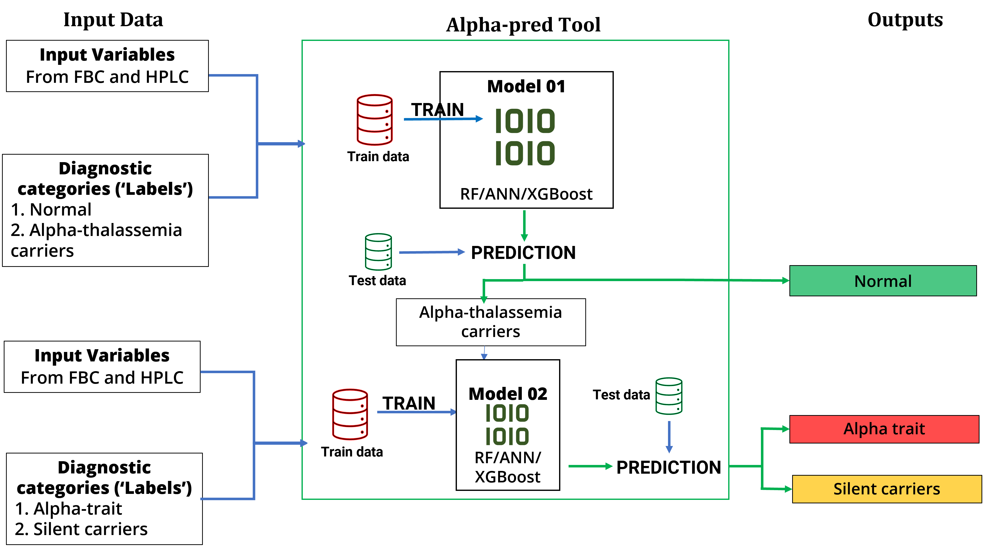

# AlphaPred
Machine learning-based classifier pipeline (AlphaPred) that differentiates between normal individuals and alpha thalassemia carriers. First model classfies between normals and alpha thalassemia carriers, and second classifies alpha carriers into alpha thalassemia traits and silent carriers, latter being the clinically milder condition.
URL of the web application built out of model 1 : https://alphaphred.herokuapp.com/

Image below depicts the structure and function of AlphaPred:

Following abstract of the research will provide a summmary of the work done :
